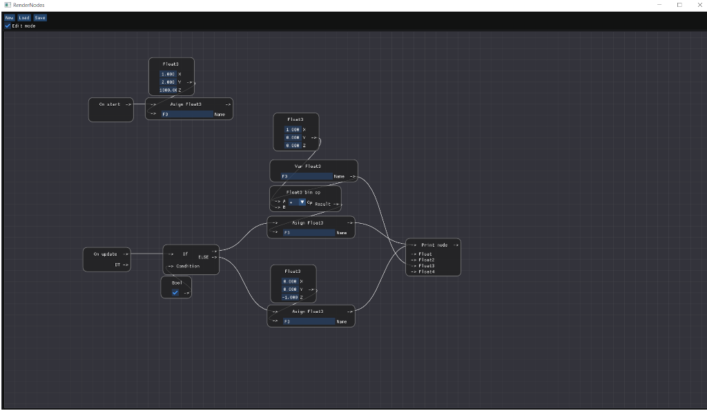

# RenderNodes

Node editor for rendering engine
Still in very early stage.

Currently supported nodes:
- Variables
- Constants
- Binary operators
- Printing
- Bool, Float, Float2, Float3, FLoat4 types
- OnStart and OnUpdate nodes
