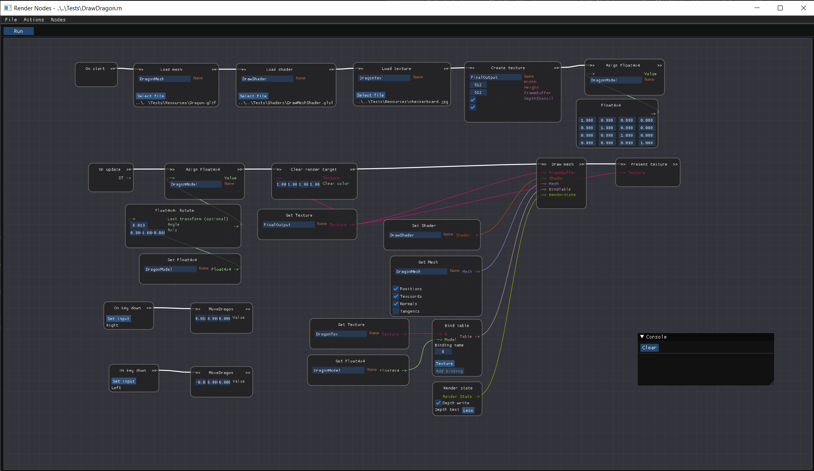

# RenderNodes

Node editor for rendering engine
Still in very early stage.

Currently supported nodes:
- OnStart and OnUpdate nodes
- Variables
- Constants
- Binary operators (arithmetic, logic and comparison)
- Printing
- Bool, Float, Float2, Float3, FLoat4, Shader, Buffer, Texture, Mesh types
- Binding tables used to bind resources to shader
- Splitting and creating vector
- Load texture, shader, mesh
- Present on screen
- Clear framebuffer
- Draw - takes as input binding table, mesh, framebuffer and shader
